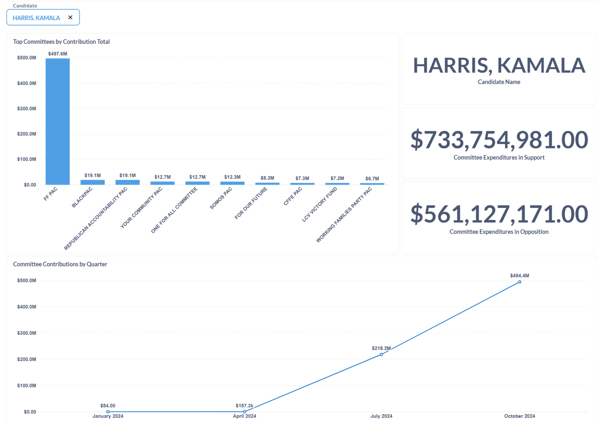

## Overview

Established in 1975 to administer and enforce the Federal Election Campaign Act of 1971, the [Federal Election Commission](https://www.fec.gov/data/browse-data/?tab=bulk-data) (FEC) provides detailed public records of campaign finance activity in the U.S., offering invaluable insights into political fundraising, spending, and donor influence. However, obtaining and working with bulk FEC data can be cumbersome due to its size, format inconsistencies, and the frequency of updates.

This project streamlines the realtime ingestion, transformation, and analysis of FEC campaign finance data using an Extract, Transform, Load, Transform (EtLT) approach. The result is a scalable, automated pipeline process that ensures timely updates and makes fresh campaign finance data accessible for analysis.

## Pipeline Structure

- **Ingestion**: A sequence of Airflow DAGs running in a Docker container extracts raw FEC data, applies minimal cleaning/processing, imposes the schema prescribed by data dictionary tables scraped directly from the FEC's website, then stages the data in an S3 bucket. The staged data are finally loaded into Snowflake for structured storage.

- **Transformation**: Initial transformations are performed in a localized sandbox environment within a Docker container using dbt, Pandas, and Polars. Once validated, repeatable transformations are pushed to a separate Docker container running Astronomer's Cosmos scheduler integrated with dbt and Snowflake so as to automate future transformation of data periodically arriving from the ingestion step.

- **Serving**: The cleaned and transformed data are visualized in Metabase.

## Data Stack
**Containerization:**
- Docker

**Orchestration:**
- Apache Airflow
- Astronomer Cosmos

**Scraping:**
- Requests
- Selenium

**Data Cleaning/Preprocessing:**
- Pandas
- Polars

**Staging:**
- AWS S3

**Data Warehouse:**
- Snowflake

**Data Transformation:**
- SQL
- dbt

**Visualization:**
- Metabase

## ERD

## Fact and Aggregate Table Lineages

| agg_indiv_contr_by_cand | agg_indiv_contr_by_state |
| -------- | ------- |
 | 

| agg_oper_exp_by_comm | agg_oper_exp_categories |
| -------- | ------- |
 | 

| agg_oper_exp_by_cand | fct_committee_contributions |
| -------- | ------- |
 | 

## Dashboards

### Individual Contributions

### Operating Expenditures

### Committee Contributions

