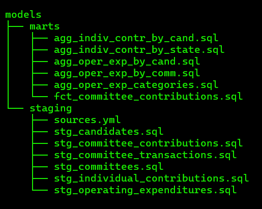
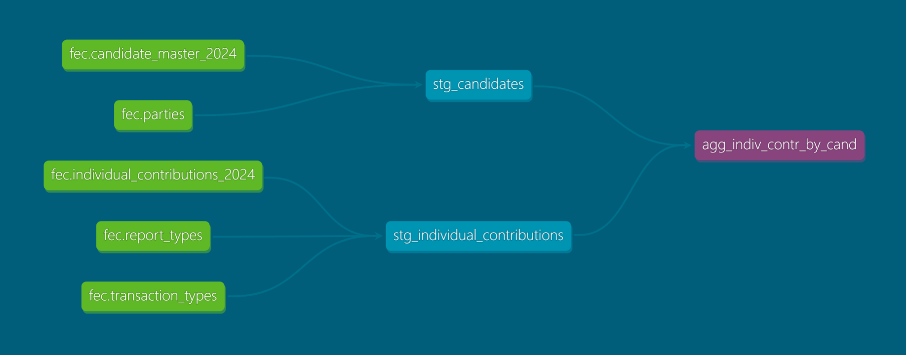
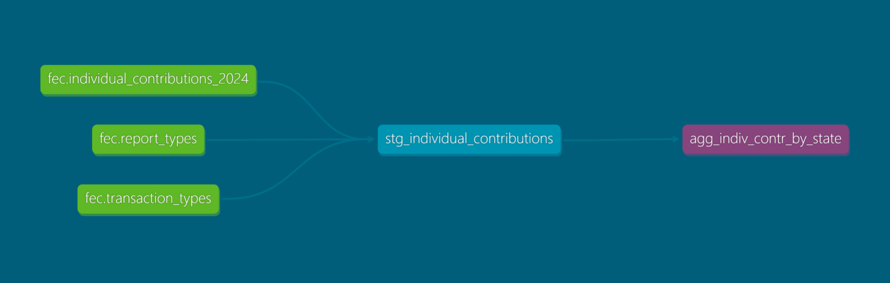
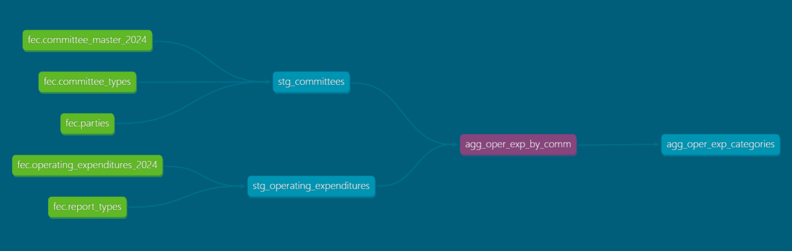
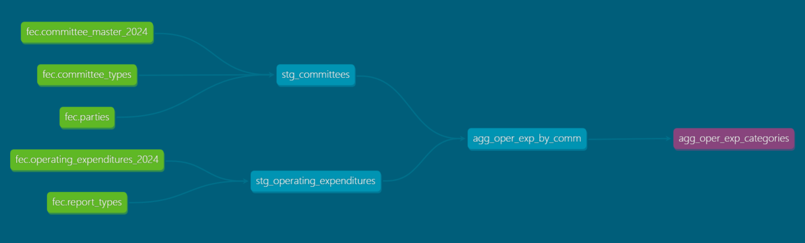
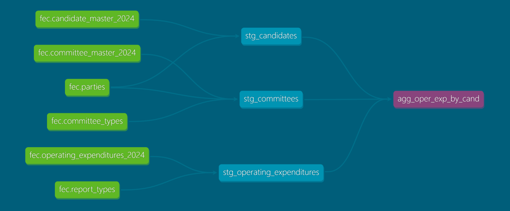
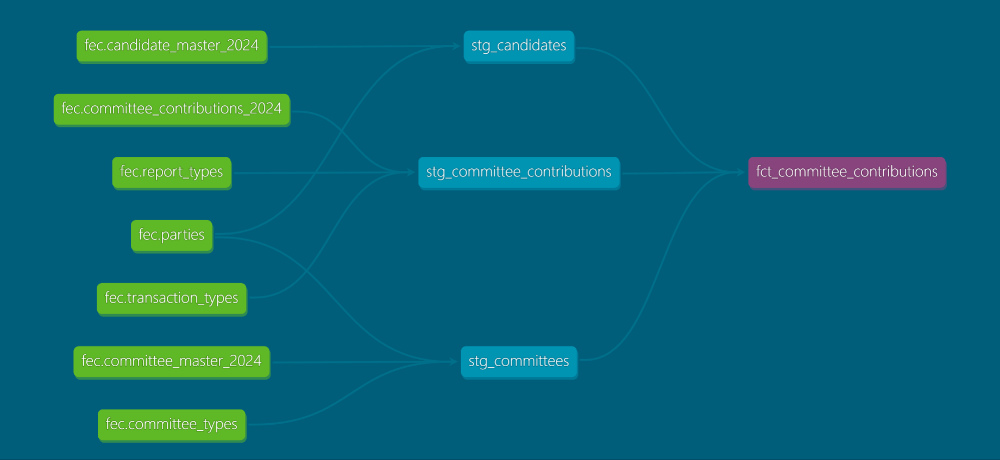

## Models

 ## Lineages

| agg_indiv_contr_by_cand | agg_indiv_contr_by_state |
| -------- | ------- |
 | 

| agg_oper_exp_by_comm | agg_oper_exp_categories |
| -------- | ------- |
 | 

| agg_oper_exp_by_cand | fct_committee_contributions |
| -------- | ------- |
 | 
